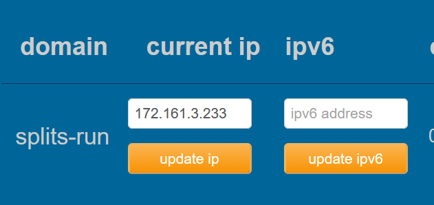

# Splits
Splits is a small api aiming to help managing speedrun events.

## Installation
Installation is donne with **docker compose**, there 2 different way : 
- Classic (basic setup, will work by it self) : 
```
docker compose up -d
```
default port : 8000

- Traefik (if you have [Traefik](https://traefik.io/traefik) set-up) :
1. Go to [/traefik/.env](/traefik/.env) and change ``[url]`` by the url you want
2. ```
   cd ./traefik
   docker compose up -d
   ```
default port : 8000


## Usage
Once up you can check if the api is alive by GET the racine endpoint, this will return "alive".
The Api is described in the [API WIKI](/API.md).

You can use the api with [api.splits-run.duckdns.org](api.splits-run.duckdns.org)

### Main concept
#### Game
Game are compose of flags, they will be check point on the run and are use to manage the run.
Every game have a final flag, when a player reach hit, the run is over

#### Flag
Simple check point, they can have priority, this is use to manage actual flag (wich is the flag where the user currently is)
beside that, priority do nothing.

##### Splits
They are time stamp post by user with the flag reached and the delta time (actual time - time when the run start) (NOT CALCULATE BY THE API)

#### User
User are manage simply, you create one, you recipe a token and you'r good to go.
**DO NOT LOSE THE TOKEN**

### API usage example (with curl)
#### create a user
```
curl -X POST url/user/create -H "Content-Type: application/json"  -d '{"name":"Bowser"}'
```
#### Get user info
```
curl -X GET url/user?username=Bowser -H "Content-Type: application/json"  
```

#### Create run
```
curl -X POST url/game/borris/create -H "Content-Type: application/json"  -d '{"token":"superToken"}'
```
#### Start run
```
curl -X POST url/game/borris/0/start -H "Content-Type: application/json"  -d '{"token":"superToken"}'
```

#### Put splits
(yea it's a post)
```
curl -X POST url/game/borris/0/put -H "Content-Type: application/json"  -d '{"token":"superToken","flagIndex":0,"time":300}'
```

## Project structure
```
Splits/
├── .gitignore
├── .idea/
│   ├── .gitignore
│   ├── encodings.xml
│   ├── misc.xml
│   └── vcs.xml
├── .mvn/
│   └── wrapper/
│       └── maven-wrapper.properties
├── API.md
├── dependency-reduced-pom.xml
├── docker-compose.yaml
├── Dockerfile
├── mvnw
├── mvnw.cmd
├── pom.xml
├── README.md
├── src/
│   └── main/
│       ├── java/
│       │   └── ch/
│       │       └── heigvd/
│       │           ├── api/
│       │           │   ├── GameController.java
│       │           │   ├── IToken.java
│       │           │   ├── PlayerController.java
│       │           │   ├── TokenData.java
│       │           │   └── userData.java
│       │           ├── data/
│       │           │   ├── Flag.java
│       │           │   ├── GameEntry.java
│       │           │   ├── Player.java
│       │           │   ├── PlayerBase.java
│       │           │   ├── Run.java
│       │           │   ├── RunEntry.java
│       │           │   ├── Split.java
│       │           │   └── TimeUtil.java
│       │           └── Main.java
│       └── resources/
│           └── public/
│               ├── Build/
│               │   ├── Web.data
│               │   ├── Web.data.bak
│               │   ├── Web.framework.js
│               │   ├── Web.loader.js
│               │   └── Web.wasm
│               ├── index.html
│               └── style.css
└── traefik/
    ├── .env
    └── docker-compose.yaml
```


### DNS Record
splits-run.duckdns.org



